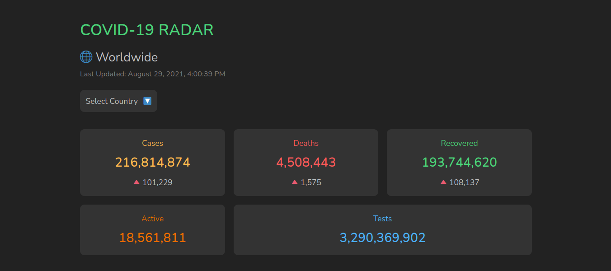

# COVID-19 RADAR



A COVID-19 dashboard application consisting of worldwide and Indonesia COVID-19 stats, timeline chart, live cases and prevention tips in an easy to use UI.

[View project](https://covid19radar.netlify.app)

## Getting Started
1. Clone this repository  
```
git clone https://github.com/rizkyzhang/covid19-radar.git
```
2. Install all dependencies
```
nmp i
```
3. Run the project
```
npm start
```

## Techs
- HTML
- CSS
- JavaScript ES6
- Web Components
- API
- chart.js
- ky
